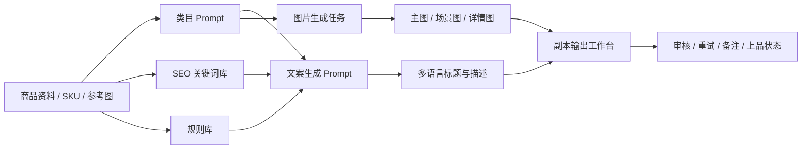
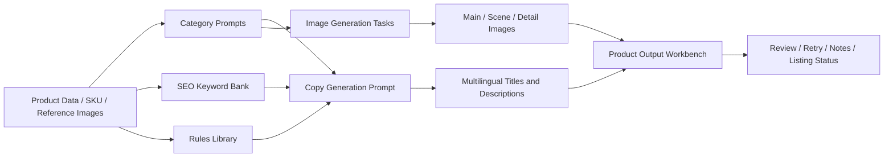

# Product Listing AI

## 中文版

### 项目简介

`Product Listing AI` 是一个面向电商商品运营场景的 AI 商品内容工作台。它把商品资料整理、标题与描述生成、商品图片生成、SEO 关键词管理、规则库维护和输出审核集中在同一个系统里，帮助用户把原始商品资料更稳定地转化为可上架的商品内容。

这个项目不是简单的聊天式 AI 工具，而是一个完整的商品内容工作流系统。它会把商品资料、类目指令、SEO 关键词、规则约束和图片任务状态都结构化保存，让生成结果可以追踪、筛选、审核和复用。

### 在线体验

[https://product-listing-ai.vercel.app](https://product-listing-ai.vercel.app)

### 主要功能

- 商品管理：创建、编辑、导入商品 SKU、原始标题、原始描述、卖点、属性和参考图。
- 多语言副本生成：为同一个商品生成不同语言和不同数量的商品标题与描述副本。
- 每副本独立图片配置：每个语言副本可以单独选择是否生成主图、场景图、详情图。
- 图片生成工作流：支持主图、场景图、详情图三类图片任务，并记录生成状态。
- 单张图片重生：可以只重生某一张图片，生成候选新图后再确认是否替换旧图。
- 副本输出工作台：集中查看生成结果、图片状态、备注、Shopee 类目和上品状态。
- SEO 关键词库：按类目和语言维护核心词、长尾词、属性词、场景词、人群词和禁用词。
- 规则库：集中维护标题、描述、图片和平台规则，并在生成时自动合并到 Prompt。
- 实时同步：商品、图片、输出、SEO 和规则数据更新后，页面可以更快同步最新状态。
- 图片稳定加载：通过服务端签名 URL 和自动刷新机制减少图片过期、白屏和加载失败。

### 工作流



### 内部逻辑

系统的核心思路是把 AI 生成从“一次性输出”变成“可管理的业务流程”。

1. 用户先录入或批量导入商品资料，包括 SKU、标题、描述、类目、卖点、属性和参考图。
2. 系统根据商品类目读取对应的图片 Prompt、SEO 关键词和启用规则。
3. 用户为不同语言设置副本数量，并为每个副本独立选择需要生成的图片类型。
4. 文案生成模块会把商品资料、类目上下文、SEO 关键词和规则库组合成结构化 Prompt。
5. 图片生成模块会把每个副本拆分为独立的图片任务，例如主图、场景图和详情图。
6. 输出结果、失败原因、候选新图、备注和上品状态都会保存到数据库。
7. 页面通过分页、筛选、实时同步和 signed URL 图片加载机制保持多人使用时的稳定性。

### 技术亮点

- `Next.js App Router`：实现页面、API 路由、服务端逻辑和前后端一体化开发。
- `TypeScript`：约束商品、副本、图片、类目、规则和 SEO 数据结构，降低状态管理风险。
- `Supabase Database`：保存商品资料、图片任务、输出记录、关键词库和规则库。
- `Supabase Auth`：处理用户注册、登录、会话校验和访问控制。
- `Supabase Storage`：存储原始参考图和 AI 生成图片，并通过 signed URL 安全访问。
- `Supabase Realtime`：让商品、图片、输出、规则和关键词更新能更快反映到页面。
- `Prompt Engineering`：将商品事实、类目指令、SEO 关键词和平台规则合并成可控 Prompt。
- `AI Image Workflow`：将图片生成、失败重试、单张重生和候选图确认拆成可追踪状态。
- `SEO Data Modeling`：按类目、语言、关键词类型和优先级组织 SEO 词库。
- `Operational UI Design`：列表筛选、分页、批量操作和审核状态适合真实商品运营流程。

### 实际用途

在真实电商运营中，商品内容通常需要反复整理、生成、检查和修改。这个系统可以帮助用户：

- 减少手动撰写商品标题和描述的时间。
- 降低多商品、多语言内容管理时的混乱程度。
- 让图片生成、失败重试和审核确认流程更清楚。
- 把 SEO 关键词和平台规则提前纳入生成流程。
- 让商品从原始资料到可发布结果的过程更标准化。

它适合商品内容运营、跨境电商上品、商品目录整理、AI 辅助 Listing 生成和多语言商品资料处理等场景。

### 界面截图建议

建议在 `docs/screenshots/` 中补充以下截图，让 GitHub 首页更直观：

- `products.png`：商品管理与新建商品页面。
- `categories.png`：类目 Prompt 与参考图管理页面。
- `product-outputs.png`：副本输出、图片状态和批量操作页面。
- `output-detail.png`：单个副本详情、图片重生和候选图确认页面。
- `seo-keywords.png`：SEO 关键词库页面。
- `rules.png`：规则库页面。

### 技术栈

- Next.js 14
- React
- TypeScript
- Supabase
- Vercel
- Gemini / OpenAI Image
- Tailwind CSS

### 本地运行

```bash
npm install
npm run dev
npm run build
```

### 常用环境变量

```bash
NEXT_PUBLIC_SUPABASE_URL=
NEXT_PUBLIC_SUPABASE_ANON_KEY=
SUPABASE_SERVICE_ROLE_KEY=
NEXT_PUBLIC_APP_URL=
BUILTIN_GEMINI_API_KEY=
BUILTIN_KEY_ACCESS_PASSWORD=
APP_EDITION=
NEXT_PUBLIC_APP_EDITION=
```

### 项目结构

```text
src/app                  Next.js 页面与 API 路由
src/components           通用 UI 组件
src/lib                  业务逻辑、Supabase、Prompt、图片和工具函数
scripts                  数据同步与维护脚本
supabase                 数据库 SQL 与工作流脚本
docs                     项目文档与截图资料
```

### 后续优化方向

- 补充 GitHub README 实际界面截图。
- 将剩余页面文案进一步集中到统一 i18n 字典。
- 增加更完整的端到端测试。
- 接入更正式的错误监控和性能观测。

---

## English Version

### Overview

`Product Listing AI` is an AI-powered ecommerce listing workspace for managing product data, generating listing copy, creating product images, maintaining SEO keyword banks, and organizing reusable content rules in one system.

It is not just a chatbot-style generation tool. It turns product content creation into a structured workflow where product facts, category prompts, SEO context, rules, image tasks, review status, and output records are all persisted and traceable.

### Live Demo

[https://product-listing-ai.vercel.app](https://product-listing-ai.vercel.app)

### Core Features

- Product management for creating, editing, and importing SKUs, titles, descriptions, selling points, attributes, and reference images.
- Multilingual copy generation for product titles and descriptions.
- Per-copy image configuration, allowing each language copy to choose its own image roles.
- Image generation workflow for main images, scene images, and detail images.
- Single-image regeneration with candidate image review before replacing the current image.
- Product output workbench for generated copy, image status, notes, Shopee category, and listing progress.
- SEO keyword banks organized by category, language, keyword type, and priority.
- Rules library for reusable copy, image, and platform constraints.
- Realtime synchronization for product, image, output, SEO, and rule updates.
- More stable image loading through server-side signed URLs and refresh handling.

### Workflow



### Internal Logic

The core idea is to turn AI generation into a repeatable operating workflow rather than a one-off response.

1. Users create or import product data, including SKU, title, description, category, selling points, attributes, and reference images.
2. The system loads related category prompts, SEO keyword context, and active rules.
3. Users configure language copy counts and choose the image roles for each copy.
4. The copy generation layer combines product facts, category context, SEO keywords, and rules into structured prompts.
5. The image generation layer expands each copy into independent image tasks such as main, scene, and detail images.
6. Generated content, failures, candidate replacement images, notes, and listing status are persisted in the database.
7. Pagination, filters, realtime events, and signed image URLs help the UI stay stable during multi-user workflows.

### Technical Highlights

- `Next.js App Router` for full-stack routing, pages, and API endpoints.
- `TypeScript` for safer data contracts across products, copies, images, categories, rules, and SEO records.
- `Supabase Database` for persistent product data, image tasks, output records, keyword banks, and rules.
- `Supabase Auth` for registration, login, session checks, and access control.
- `Supabase Storage` for original reference images and AI-generated output images.
- `Supabase Realtime` for faster UI updates when shared data changes.
- `Prompt Engineering` for combining product facts, category instructions, SEO context, and platform rules.
- `AI Image Workflow` for generation, retry, single-image regeneration, and candidate confirmation states.
- `SEO Data Modeling` for category-aware and language-aware keyword management.
- `Operational UI Design` with filters, pagination, batch actions, and review-oriented status controls.

### Real-World Value

In ecommerce operations, product content often needs to be collected, generated, reviewed, revised, and tracked repeatedly. This project helps users:

- reduce manual title and description writing time;
- manage multilingual product content more consistently;
- make image generation, retry, and review workflows easier to follow;
- include SEO and platform rules earlier in the generation process;
- standardize the path from raw product data to publish-ready listing assets.

It is useful for ecommerce content operations, cross-border marketplace listing, catalog preparation, AI-assisted listing creation, and multilingual product data workflows.

### Screenshot Suggestions

Recommended screenshots for `docs/screenshots/`:

- `products.png`: product management and product creation.
- `categories.png`: category prompts and reference images.
- `product-outputs.png`: output workbench, image status, and batch actions.
- `output-detail.png`: output detail page, image regeneration, and candidate confirmation.
- `seo-keywords.png`: SEO keyword bank.
- `rules.png`: reusable rules library.

### Tech Stack

- Next.js 14
- React
- TypeScript
- Supabase
- Vercel
- Gemini / OpenAI Image
- Tailwind CSS

### Local Development

```bash
npm install
npm run dev
npm run build
```

### Common Environment Variables

```bash
NEXT_PUBLIC_SUPABASE_URL=
NEXT_PUBLIC_SUPABASE_ANON_KEY=
SUPABASE_SERVICE_ROLE_KEY=
NEXT_PUBLIC_APP_URL=
BUILTIN_GEMINI_API_KEY=
BUILTIN_KEY_ACCESS_PASSWORD=
APP_EDITION=
NEXT_PUBLIC_APP_EDITION=
```

### Project Structure

```text
src/app                  Next.js pages and API routes
src/components           Shared UI components
src/lib                  Business logic, Supabase helpers, prompts, image utilities
scripts                  Data sync and maintenance scripts
supabase                 Database SQL and workflow scripts
docs                     Project documentation and screenshot assets
```

### Future Improvements

- Add real screenshots to the GitHub README.
- Move remaining page copy into the shared i18n dictionary.
- Add broader end-to-end tests.
- Connect formal error monitoring and performance observability.
